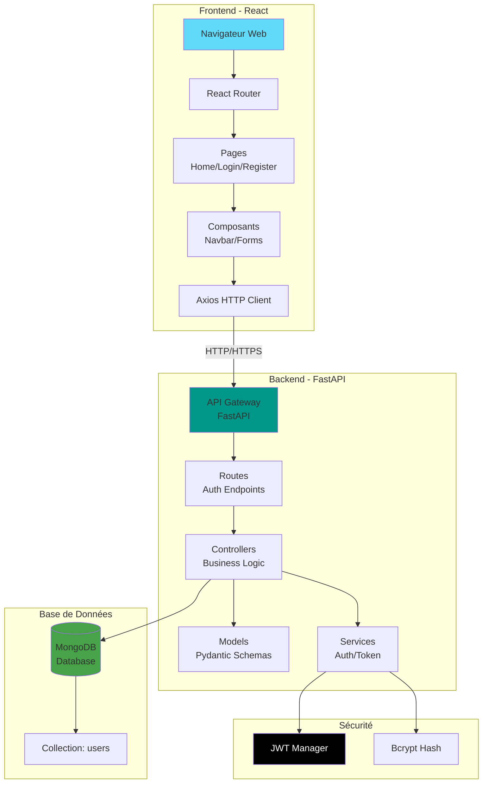
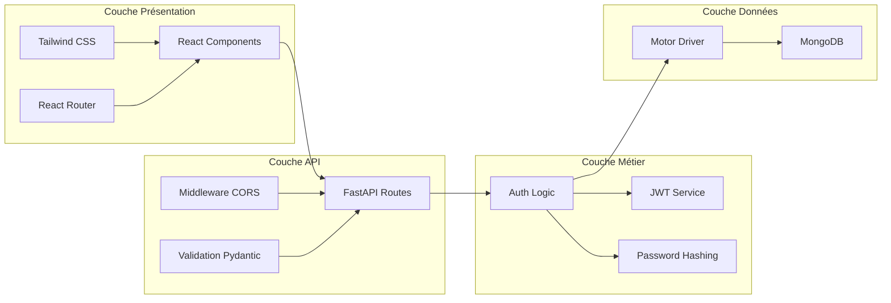
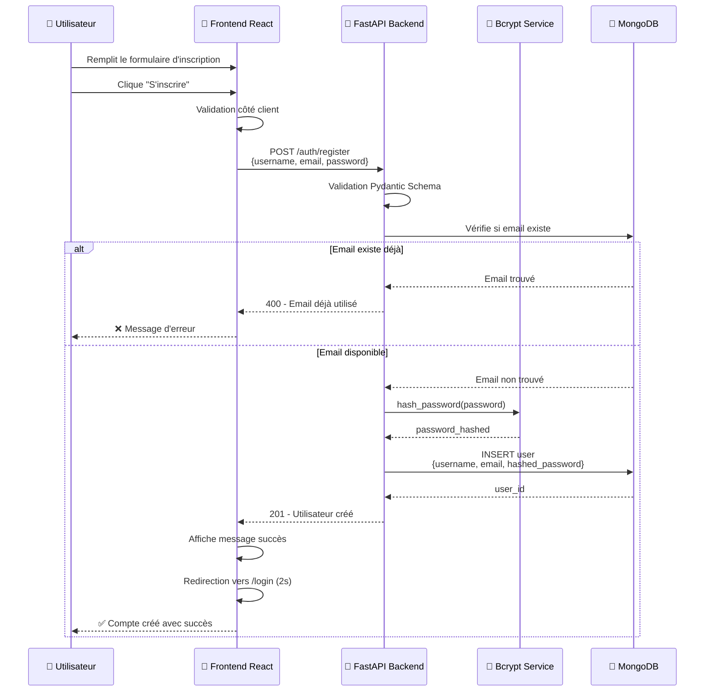
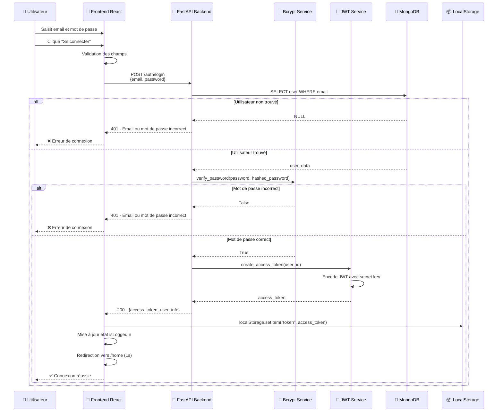
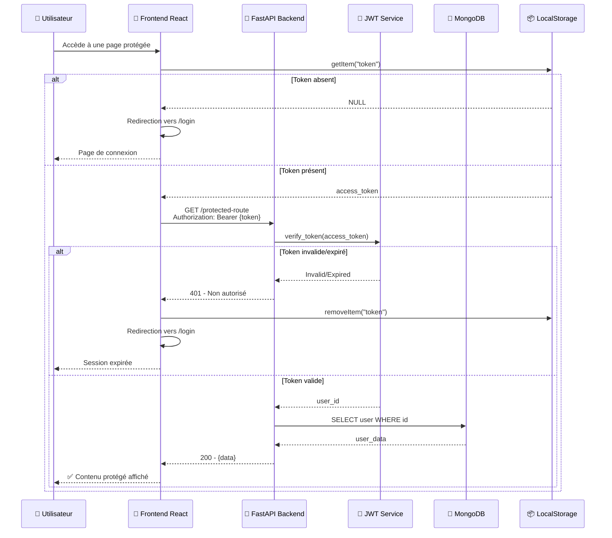
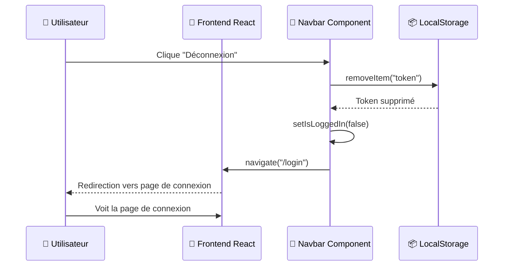
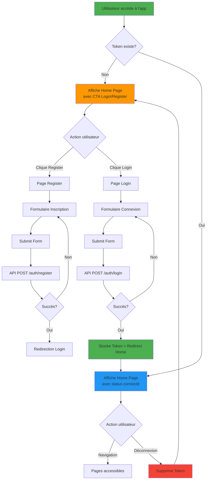
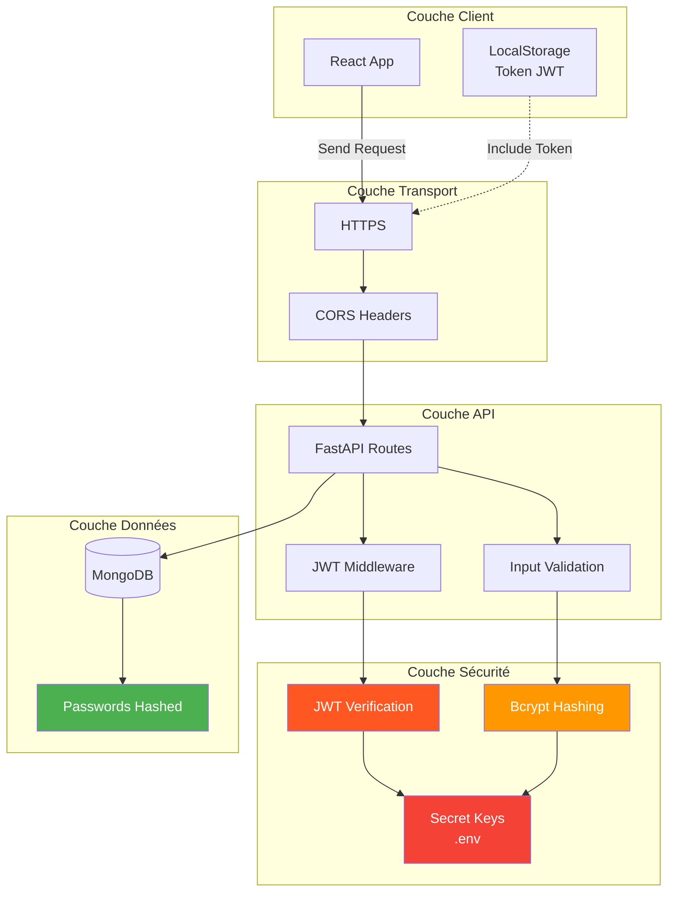

# 🔐 FastAPI JWT Auth MongoDB

Application d'authentification moderne et sécurisée construite avec FastAPI, MongoDB et React. Ce projet met en place un système complet d'authentification JWT avec une interface utilisateur responsive et élégante.


---

## 📋 Table des Matières

- [Aperçu du Projet](#-aperçu-du-projet)
- [Architecture](#-architecture)
- [Diagrammes](#-diagrammes)
- [Technologies Utilisées](#-technologies-utilisées)
- [Structure du Projet](#-structure-du-projet)
- [Installation](#-installation)
- [Configuration](#-configuration)
- [Utilisation](#-utilisation)
- [API Endpoints](#-api-endpoints)
- [Sécurité](#-sécurité)
- [Contribution](#-contribution)

---

## 🎯 Aperçu du Projet

Ce projet est une application full-stack d'authentification qui démontre les meilleures pratiques en matière de :
- ✅ Authentification sécurisée avec JWT (JSON Web Tokens)
- ✅ Hashage des mots de passe avec Bcrypt
- ✅ Base de données NoSQL (MongoDB)
- ✅ API RESTful avec FastAPI
- ✅ Interface utilisateur moderne et responsive avec React
- ✅ Gestion d'état et routing côté client
- ✅ Protection CORS et sécurité des endpoints

---

## 🏗 Architecture

### Architecture Globale du Système



### Architecture en Couches



---

## 📊 Diagrammes

### 1. Diagramme de Séquence - Inscription (Register)



### 2. Diagramme de Séquence - Connexion (Login)



### 3. Diagramme de Séquence - Accès Page Protégée



### 4. Diagramme de Séquence - Déconnexion (Logout)



### 5. Flux de Communication Globale



### 6. Architecture de Sécurité



---

## 🛠 Technologies Utilisées

### Backend
- **FastAPI** `0.115.2` - Framework web moderne et rapide pour construire des APIs
- **Uvicorn** `0.30.6` - Serveur ASGI pour FastAPI
- **Motor** `3.6.0` - Driver asynchrone MongoDB pour Python
- **Passlib + Bcrypt** `1.7.4` - Librairie de hashing de mots de passe
- **Python-Jose** `3.3.0` - Implémentation JWT pour Python
- **Pydantic** `2.9.2` - Validation des données avec Python type hints
- **Python-Dotenv** `1.0.1` - Gestion des variables d'environnement

### Frontend
- **React** `19.1.1` - Librairie JavaScript pour construire l'interface utilisateur
- **React Router DOM** `7.9.5` - Routing pour applications React
- **Axios** `1.13.2` - Client HTTP pour les requêtes API
- **TailwindCSS** - Framework CSS utility-first pour le styling
- **Vite** - Build tool rapide pour le développement frontend

### Base de Données
- **MongoDB** - Base de données NoSQL orientée documents

---

## 📁 Structure du Projet

```
fastapi-jwt-auth-mongodb/
│
├── backend/                          # Backend FastAPI
│   ├── app/
│   │   ├── __init__.py
│   │   ├── main.py                   # Point d'entrée de l'application
│   │   ├── config.py                 # Configuration (MongoDB, JWT secret)
│   │   ├── models/
│   │   │   ├── __init__.py
│   │   │   └── user.py               # Schémas Pydantic pour User
│   │   ├── routes/
│   │   │   ├── __init__.py
│   │   │   └── auth.py               # Routes d'authentification
│   │   ├── services/
│   │   │   ├── __init__.py
│   │   │   ├── auth_service.py       # Logique métier auth
│   │   │   └── jwt_service.py        # Gestion JWT
│   │   └── utils/
│   │       ├── __init__.py
│   │       └── security.py           # Utilitaires de sécurité
│   ├── .env                          # Variables d'environnement
│   └── requirements.txt              # Dépendances Python
│
├── frontend/                         # Frontend React
│   ├── public/
│   │   └── vite.svg
│   ├── src/
│   │   ├── api/
│   │   │   └── axois.js              # Configuration Axios
│   │   ├── components/
│   │   │   └── Navbar.jsx            # Composant Navbar
│   │   ├── pages/
│   │   │   ├── Home.jsx              # Page d'accueil
│   │   │   ├── Login.jsx             # Page de connexion
│   │   │   └── Register.jsx          # Page d'inscription
│   │   ├── App.jsx                   # Composant principal
│   │   ├── App.css
│   │   ├── index.css                 # Styles globaux
│   │   └── main.jsx                  # Point d'entrée React
│   ├── .gitignore
│   ├── index.html
│   ├── package.json                  # Dépendances npm
│   ├── tailwind.config.js            # Configuration Tailwind
│   └── vite.config.js                # Configuration Vite
│
└── README.md                         # Documentation (ce fichier)
```

---

## 🚀 Installation

### Prérequis

- **Python** 3.8+
- **Node.js** 16+ et npm
- **MongoDB** installé et en cours d'exécution

### 1. Cloner le Repository

```bash
git clone https://github.com/Saidouchrif/fastapi-jwt-auth-mongodb.git
cd fastapi-jwt-auth-mongodb
```

### 2. Installation du Backend

```bash
cd backend

# Créer un environnement virtuel
python -m venv venv

# Activer l'environnement virtuel
# Windows:
venv\Scripts\activate
# Linux/Mac:
source venv/bin/activate

# Installer les dépendances
pip install -r requirements.txt
```

### 3. Installation du Frontend

```bash
cd ../frontend

# Installer les dépendances
npm install
```

---

## ⚙ Configuration

### Configuration Backend (.env)

Créez un fichier `.env` dans le dossier `backend/` :

```env
# MongoDB Configuration
MONGODB_URL=mongodb://localhost:27017
DATABASE_NAME=fastapi_auth_db

# JWT Configuration
SECRET_KEY=votre_secret_key_super_securisee_ici_changez_la
ALGORITHM=HS256
ACCESS_TOKEN_EXPIRE_MINUTES=30

# CORS Origins
CORS_ORIGINS=http://localhost:5173,http://localhost:3000

# Server Configuration
HOST=0.0.0.0
PORT=5000
```

⚠️ **Important**: Changez `SECRET_KEY` par une clé secrète forte et unique. Vous pouvez en générer une avec :

```bash
python -c "import secrets; print(secrets.token_urlsafe(32))"
```

### Configuration Frontend

Le fichier `src/api/axois.js` est configuré pour pointer vers le backend :

```javascript
const API = axios.create({
  baseURL: "http://127.0.0.1:5000",
  headers: {
    "Content-Type": "application/json",
  },
  withCredentials: true,
});
```

---

## 💻 Utilisation

### Démarrer MongoDB

```bash
# Windows
net start MongoDB

# Linux/Mac
sudo systemctl start mongod
```

### Démarrer le Backend

```bash
cd backend
uvicorn app.main:app --reload --host 0.0.0.0 --port 5000
```

Le backend sera accessible sur `http://localhost:5000`

Documentation API interactive : `http://localhost:5000/docs`

### Démarrer le Frontend

```bash
cd frontend
npm run dev
```

Le frontend sera accessible sur `http://localhost:5173`

---

## 📡 API Endpoints

### Base URL
```
http://localhost:5000
```

### Endpoints d'Authentification

#### 1. Inscription d'un Utilisateur

```http
POST /auth/register
Content-Type: application/json

{
  "username": "john_doe",
  "email": "john@example.com",
  "password": "securePassword123"
}
```

**Réponse Succès (201):**
```json
{
  "msg": "Utilisateur créé avec succès",
  "user_id": "507f1f77bcf86cd799439011"
}
```

**Réponse Erreur (400):**
```json
{
  "detail": "Email déjà utilisé"
}
```

#### 2. Connexion

```http
POST /auth/login
Content-Type: application/json

{
  "email": "john@example.com",
  "password": "securePassword123"
}
```

**Réponse Succès (200):**
```json
{
  "access_token": "eyJhbGciOiJIUzI1NiIsInR5cCI6IkpXVCJ9...",
  "token_type": "bearer",
  "user": {
    "id": "507f1f77bcf86cd799439011",
    "username": "john_doe",
    "email": "john@example.com"
  }
}
```

**Réponse Erreur (401):**
```json
{
  "detail": "Email ou mot de passe incorrect"
}
```

#### 3. Obtenir le Profil (Protégé)

```http
GET /auth/me
Authorization: Bearer {access_token}
```

**Réponse Succès (200):**
```json
{
  "id": "507f1f77bcf86cd799439011",
  "username": "john_doe",
  "email": "john@example.com",
  "created_at": "2024-11-07T14:30:00"
}
```

---

## 🔒 Sécurité

### Mesures de Sécurité Implémentées

1. **Hashage des Mots de Passe**
   - Utilisation de Bcrypt avec salt
   - Les mots de passe ne sont jamais stockés en clair

2. **Tokens JWT**
   - Tokens signés avec une clé secrète
   - Expiration configurable (30 minutes par défaut)
   - Stockage côté client dans localStorage

3. **CORS**
   - Configuration des origines autorisées
   - Protection contre les requêtes cross-origin non autorisées

4. **Validation des Données**
   - Validation avec Pydantic sur le backend
   - Validation HTML5 sur le frontend

5. **HTTPS (Production)**
   - Recommandé d'utiliser HTTPS en production
   - Certificats SSL/TLS

### Bonnes Pratiques

- ✅ Ne jamais commiter le fichier `.env`
- ✅ Utiliser des mots de passe forts
- ✅ Régénérer les tokens après un certain temps
- ✅ Implémenter un rate limiting en production
- ✅ Ajouter une authentification à deux facteurs (2FA)

---

## 🤝 Contribution

Les contributions sont les bienvenues ! Pour contribuer :

1. Fork le projet
2. Créez votre branche (`git checkout -b feature/AmazingFeature`)
3. Committez vos changements (`git commit -m 'Add some AmazingFeature'`)
4. Push vers la branche (`git push origin feature/AmazingFeature`)
5. Ouvrez une Pull Request

---

## 📝 Licence

Ce projet est sous licence MIT.

---

## 👨‍💻 Auteur

**Saïd Ouchrif**

- GitHub: [@Saidouchrif](https://github.com/Saidouchrif)
- Projet: [fastapi-jwt-auth-mongodb](https://github.com/Saidouchrif/fastapi-jwt-auth-mongodb)

---

## 🙏 Remerciements

- FastAPI pour le framework backend incroyable
- React pour la librairie frontend puissante
- MongoDB pour la base de données flexible
- TailwindCSS pour le styling moderne

---

## 📚 Ressources Supplémentaires

- [Documentation FastAPI](https://fastapi.tiangolo.com/)
- [Documentation React](https://react.dev/)
- [Documentation MongoDB](https://docs.mongodb.com/)
- [Documentation JWT](https://jwt.io/introduction)
- [Documentation TailwindCSS](https://tailwindcss.com/docs)

---

**⭐ Si ce projet vous a aidé, n'hésitez pas à lui donner une étoile sur GitHub !**
